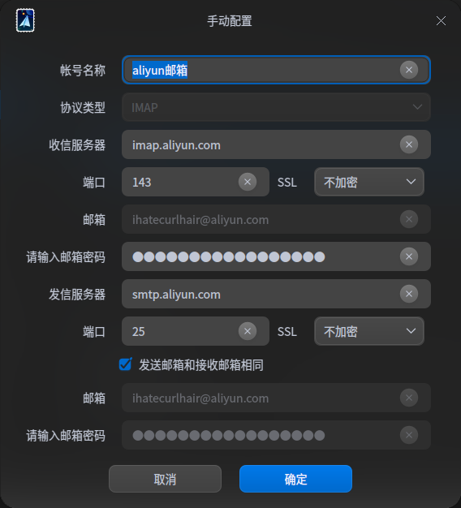

@[toc]
# 开启Root账户

新安装的deepin系统，默认root账户关闭，需要手动打开

```shell
ihch17@ihch17-PC:~$ sudo passwd root

我们信任您已经从系统管理员那里了解了日常注意事项。
总结起来无外乎这三点：

    #1) 尊重别人的隐私。
    #2) 输入前要先考虑(后果和风险)。
    #3) 权力越大，责任越大。

请输入密码
[sudo] ihch17 的密码：
验证成功
新的 密码：
重新输入新的 密码：
passwd：已成功更新密码
ihch17@ihch17-PC:~$ su
请输入密码
Password:
验证成功
```

# 邮箱设置aliyun账户



# 软件安装

- 我喜欢在/home/username/下新建软件文件夹，专门用来存放自己的软件，避免了一些权限问题。
- 以下所有的软件我均存放在/home/ihch17/软件/文件夹中，以下均成为**指定位置**。

## JDK

1. 将JDK存放在指定位置

2. 添加环境变量

   1. ```shell
      sudo vim /etc/profile
      ```

   2. 在profile中，添加以下内容

      ```shell
      export JAVA_HOME=/home/ihch17/软件/jdk1.8.0_281
      export JRE_HOME=${JAVA_HOME}/jre
      export CLASSPATH=.:${JAVA_HOME}/lib:${JRE_HOME}/lib
      export PATH=${JAVA_HOME}/bin:$PATH
      ```

   3. 执行命令，使环境变量生效

      ```shell
      source /etc/profile
      ```

   4. 测试

      ```shell
      root@ihch17-PC:~# java -version
      java version "1.8.0_281"
      Java(TM) SE Runtime Environment (build 1.8.0_281-b09)
      Java HotSpot(TM) 64-Bit Server VM (build 25.281-b09, mixed mode)
      ```

## Git

1. 安装

   ```shell
   sudo apt install git
   ```

2. 完成后，设置git全局用户名和邮箱

   ```shell
   git config --global user.name "git的用户名"
   git config --global user.email "git的邮箱"
   ```

   

## Maven

1. 将Maven存放在指定位置

2. 添加环境变量

   1. ```shell
      sudo vim /etc/profile
      ```

   2. 在profile末尾，添加以下内容

      ```shell
      export MAVEN_HOME=/home/ihch17/软件/apache-maven-3.6.3
      export PATH=$MAVEN_HOME/bin:$PATH
      ```

3. 执行命令，使环境变量生效

   ```shell
   source /etc/profile
   ```

4. 测试

   ```shell
   root@ihch17-PC:~# mvn -version
   Apache Maven 3.6.3 (cecedd343002696d0abb50b32b541b8a6ba2883f)
   Maven home: /home/ihch17/软件/apache-maven-3.6.3
   Java version: 1.8.0_281, vendor: Oracle Corporation, runtime: /home/ihch17/软件/jdk1.8.0_281/jre
   Default locale: zh_CN, platform encoding: UTF-8
   OS name: "linux", version: "5.8.14-amd64-desktop", arch: "amd64", family: "unix"
   ```

## MySQL

1. 下载包

   ```shell
   wget https://dev.mysql.com/get/Downloads/MySQL-8.0/mysql-server_8.0.22-1debian10_amd64.deb-bundle.tar
   ```

2. 解压到指定位置

3. 删除测试和debug的包

   ```shell
   rm *test*
   ```

4. 安装

   ```shell
   sudo apt-get install libmecab2 libjson-perl #安装依赖包
   sudo dpkg -i mysql-*.deb #安装所有的包
   ```

   `安装过程中会弹出密码设置，按照说明指定密码即可`

## Docker

> 感谢#忘乎所以#，以下为原味链接
>
> [原文链接](https://www.cnblogs.com/zllwxm123/p/11704142.html)

1. 第一次安装Docker时，要先设置Docker存储库

   1. 使用以下命令更新apt包索引

      ```shell
      sudo apt-get update
      ```

   2. 安装以下包以允许apt通过HTTPS使用存储库

      ```shell
      sudo apt-get install apt-transport-https ca-certificates curl gnupg2 software-properties-common
      ```

      `安装完成后，在输入一遍上面的命令，就出现都已经是最新版。`

   3. 添加Docker的官方GPG密钥并载入密钥

      ```shell
      curl -fsSL https://download.docker.com/linux/ubuntu/gpg | sudo apt-key add -
      ```

   4. 设置稳定的存储库//添加软件源

      ```shell
      sudo vim /etc/apt/sources.list
      ```

      在文件最下面添加

      ```shell
      deb https://download.docker.com/linux/debian stretch stable
      ```

2. 安装Docker

   1. 更新apt包索引

      ```shell
      sudo apt-get update
      ```

   2. 安装最新版本的Docker CE和containerd

      ```shell
      sudo apt-get install docker-ce docker-ce-cli containerd.io
      ```

   3. 验证docker是否安装成功

      ```shell
      root@ihch17-PC:/home/ihch17/软件# docker ps
      CONTAINER ID        IMAGE               COMMAND             CREATED             STATUS              PORTS               NAMES
      ```

3. 修改Docker国内镜像源

   1. 新建daemon.json文件

      ```shell
      touch /etc/docker/daemon.json
      ```

   2. daemon.json中编辑内容

      ```
      vim /etc/docker/daemon.json
      ```

      ```json
      {
        "registry-mirrors" : [        
          "http://docker.mirrors.ustc.edu.cn",
          "http://registry.docker-cn.com",
          "http://hub-mirror.c.163.com"
        ],
        "insecure-registries" : [
          "registry.docker-cn.com",
          "docker.mirrors.ustc.edu.cn"
        ],
        "debug" : true,
        "experimental" : true
      }
      ```

   3. 重启Docker

      ```bash
      systemctl restart docker
      ```

   4. 设置国内镜像源

      修改maven文件夹下/config/settings.xml，在mirrors标签中添加以下内容

      ```xml
      <mirror>  
          <id>nexus-aliyun</id>  
          <mirrorOf>central</mirrorOf>    
          <name>Nexus aliyun</name>  
          <url>http://maven.aliyun.com/nexus/content/groups/public</url>  
      </mirror> 
      ```

      

## Redis

1. 安装

   ```shell
   sudo apt-get install redis-server
   ```

2. 连接测试

   ```shell
   root@ihch17-PC:~# redis-cli
   127.0.0.1:6379> ping
   PONG
   127.0.0.1:6379> exit
   ```

# 关于启动器中没有图标的问题

某些诸如idea等软件，在下载jar并解压后，可以直接运行。但是起动器中并没有相应的图标可以快捷的起动。

Deepin中起动器图标均位于/usr/share/applications/目录下，文件名为.desktop

下面以idea为例添加图标

1. 获取root权限后，在上述目录中新建idea.desktop文件

   ```shell
   root@ihch17-PC:/usr/share/applications# touch idea.desktop
   ```

2. 编辑idea.desktop文件

   ```shell
   root@ihch17-PC:/usr/share/applications# vim idea.desktop
   ```

   内容为

   ```shell
   [Desktop Entry]
   Type=Application
   Categories=Development
   Name=IDEA
   Exec=/home/ihch17/软件/idea-IU-203.6682.168/bin/idea.sh
   Icon=/home/ihch17/软件/idea-IU-203.6682.168/bin/idea.png
   ```

   `注：其中Exec为应用程序路径，Icon为图标图片路径`

3. 保存退出后起动器中出现图标

# Deepin系统备份恢复

## 制作live系统

deepin live系统可直接将系统装在U盘上，并可通过U盘引导进入live系统。

live系统内包含多种系统工具，我们备份/恢复系统需要用到的软件均在这里。

1. 在官网下载live的镜像文件。[官网地址](https://www.deepin.org/zh/download/)
2. 下载完成后，使用系统自带的启动盘制作工具制作live系统盘。由于live系统仅含有必要的系统文件以及工具，所以很小，300+MB。所以我们只需要准备1个1G以上的U盘即可。
3. 等待工具自动制作完成即可。

## 备份/恢复系统

1. 使用刚刚制作的live系统U盘，进入live系统。

2. 使用live系统中的“深度备份恢复工具”进行需要的操作。该工具有3个主要选项

   1. 克隆分区：克隆分区数据到另外一个分区
   2. 备份分区到镜像：备份分区数据到一个镜像文件。备份使用这个选项进行备份系统。
   3. 从镜像恢复到分区：从镜像文件还原数据到分区。恢复系统时选择这个选项

3. 另外找1个大点的U盘，并将其格式化为**ext4格式**，进行系统备份吧。

   **注意：因为我们制作的live系统U盘为VFAT格式，最大支持的单个文件为4个G，所以无法将系统恢复文件放于live系统盘中。**

4. 等待完成后，我们得到dim格式的镜像文件。以后我们进入live系统，使用这个文件恢复即可。

# windows/deepin双系统

1. 正常安装windows

2. 在windows中新建分区/使用其他硬盘分区安装deepin

3. 设置deepin分区为首启动项

4. 进入deepin系统，在控制中心-通用-启动菜单中，查看是否有windows启动项。

5. 若deepin启动过程中，启动项选择时没有windows选项，则在终端输入

   ```shell
   sudo update-grub2
   ```

6. 完成后重新启动，则看到