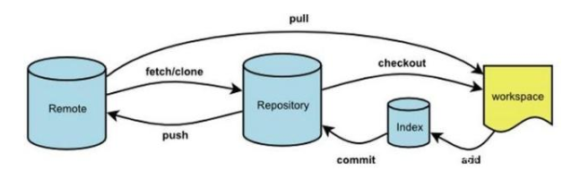

[toc]

# 概述

## Git特点

1. 存储能力
2. 高性能
3. 开源
4. 易备份
5. 支持离线
6. 工作流程

# Git对象

1. commit
2. tree
3. blob

`1个commit对应1个tree，1个tree可能有那个子tree和n个blob`

# 使用

## 最小配置

在使用git之前，需要设置git使用人员的用户名以及邮箱。

git中，用户配置有三种作用域：

```bash
git config --local		# 只对当前仓库有效
git config --global		# 多当前用户所有仓库有效
git config --system		# 对系统所有登陆的用户有效
```

三种作用域可以根据用户需要的方式配置其中一个作用域即可，如果同时设置，git`优先级`为：**local > global > system**

设置用户配置命令：

```bash
git config --global user.name 'your_name'
git config --global user.email 'your_email'
```

设置完成之后，可以使用一下命令查看：

```bash
git config --list --local		#显示local作用域下的配置
```

## 新建Git仓库

当我们完成git初始配置后，就可以开始使用git了。每个需要被git托管的项目，都需要进行git的`初始化`。具体的初始化方式有两种

1. 场景1：把已有的项目纳入git :star2:

   ```bash
   git init
   ```

2. 场景2：新建的项目直接用git管理

   ```bash
   git init your_project
   ```

## 工作区、暂存区以及版本库



### 基本命令

```bash
git status		# 查看git状态
git mv oldName newName		# 修改文件名称并add
git rm file					#删除文件并add 
git commit --amend			# 修改commit的message
```

### 提交

1. 工作区提交到暂存区
2. 暂存区提交到版本库

#### 工作区提交到暂存区

```bash
git add 文件名		# 追踪文件
git add .		# 追踪所有文件
```

#### 暂存区提交到版本库

```bash
git commit -m ‘描述’	# 提交到版本库
```

### 合并commit

```
git rebase -i
```

### 回滚

#### 回滚到当前HEAD指针指向的commit（即清空缓存区和工作区）

```bash
git reset --hard HEAD
git reset --hard HEAD <file>
git reset --hard HEAD -- [file1 file2 ...]
```

#### 回滚到以前的commit

git回滚commit有三种方式：

```bash
git reset --hard commitNumber	# 根据commitNumber进行回滚
git reset --hard HEAD^			# 回滚到上一个commit（一个^指向上一级，两个^指向上上级，以此类推），只能后退，无法前进
git reset --hard HEAD~1			# 回滚到上一个commit（~1指向上一级，~2指向上上级，以此类推），只能后退，无法前进
```

#####  git reset的三种模式

git reset后面有三种参数，分别为：

```bash
git reset --soft HEAD^	# 只改变HEAD指针，保留工作区和缓冲区内容
git reset --mixed HEAD^	# 默认，改变HEAD指针，并重置暂存区
git reset --hard HEAD^	# 改变HEAD指针，并重置工作区以及暂存区所有内容
```

#### 工作区回滚到暂存区状态

```bash
git checkout -- fileName
```

## 版本历史

通过log命令，我们可以看到所有commit的相关内容

```bash
git log				# 查看commit
git log --all		# 查看所有的commit
git log branchName	# 查看branchName分支的log
git log --oneline	# 简洁方式查看commit
git log -n4		# 查看最近4个commit
git log --graph		# 图形化展示分支查看commit
```

## 文件比较

git使用diff命令针对各个区域的同一文件进行对比

1. 工作区与暂存区比较

   ```bash
   git diff		# 当前HEAD比较工作区与暂存区所有文件的区别
   git diff [file1 file2 ...]	# 比较file1、file2、...等指定文件的区别
   git diff commitNumber [file1 file2 ...]	# 将工作区中的文件与本地库历史记录比较
   ```

2. 暂存区与版本库比较

   ```bash
   git diff --cached [file1 file2 ...]
   ```

3. 分支之间比较

   ```bash
   git diff branch1 branch2		#比较branch1和branch2之间所有文件
   git diff branch1 branch2 [file]		#比较branch1和branch2之间file文件
   ```
   
   

## :star2:分支

开发时，git允许我们针对某个commit形成一个新的分支同时开发。各个分支之间互不影响

### 分支操作

1. 查看信息

   ```bash
   git branch -v	# 查看所有分支信息
   ```

2. 新建分支

   ```bash
   git branch branchName	# 创建名为branchName的分支
   git branch branchName commitNumber	# 根据commitNumber创建分支，名称为branchName
   git checkout -b branchName commitNumber	# 根据commitNumber创建分支，名称为branchName。并切换到新分支上
   ```

3. 切换分支

   ```bash
   git checkout branchName		# 切换到branchName分支
   ```

4. 合并分支

   > 一下以feature分支合并到master分支为例子

   1. 先切换到需要被合并的分支上。此案例中，被合并分支为master

      ```bash
      git checkout master
      ```

   2. 使用merge命令进行合并

      ```bash
      git merge feature
      ```

   3. 解决冲突

5. 删除分支

   ```bash
   git branch -d branchName	# 删除branchName分支
   ```

## 将暂存区内容临时存储

在某些时候，我们正在开发的内容并未完成，但是需要临时切换到其他branch或者commit上去degug。这时，我们需要将暂存区的内容临时进行存储。

```bash
git stash
```

git stash是将暂存区的内容存入一个栈中。等到我们完成其他内容，再从栈中得到暂存区的内容。

`得到存储在栈中的暂存区内容`有两种方式

```bash
git stash apply
git stash pop
```

git stash apply是恢复暂存区内容，但是栈中存储的内容`并未出栈`。   

git stash pop是恢复暂存区内容并且出栈，出栈后栈顶内容`删除`。

## 指定不需要被git管理的文件

在git托管的项目中，.gitignore文件里可以描述不需要被git管理的文件

```
# Compiled class file
*.class

# Log file
*.log

# BlueJ files
*.ctxt

# Mobile Tools for Java (J2ME)
.mtj.tmp/

# Package Files #
*.jar
*.war
*.nar
*.ear
*.zip
*.tar.gz
*.rar

# virtual machine crash logs, see http://www.java.com/en/download/help/error_hotspot.xml
hs_err_pid*
```

## 远程仓库操作

```bash
git remote -v						# 显示所有远程仓库
git remote show [remoteName]		# 显示远程仓库信息
git remote add [remoteName] [url]	# 添加远程版本库
git push remoteName --all			# 推送所有本地内容到远程版本库
git push remoteName branchName		# 推送branchName分支到远程版本库
git pull remoteName --all			# 从remoteName远程版本库拉取所有内容
git remote rm name					# 删除远程仓库
git remote rename oldName newName	# 重命名远程仓库 
```

**pull=fetch+merge**

### merge非fast-forward仓库

有时在开发过程中，远程版本库分支与本地版本库分支并无关联（非fast-forward），提示

```bash
fatal: 拒绝合并无关的历史
```

这时，我们需要设置允许合并不关联历史

```bash
git merge --allow-unrelated-histories github/master
```

# 其他重要概念

## 分离头指针

> 当前Head指针并未指向branch，而是指向了具体的commit。也就是当前commit并未与任何branch挂钩。
>
> 当切换分支时，git将把当前commit当做垃圾处理

当操作结束时，如果此commit需要保存，必须将其绑定到branch上

```bash
git branch branchName commitNumber
```
