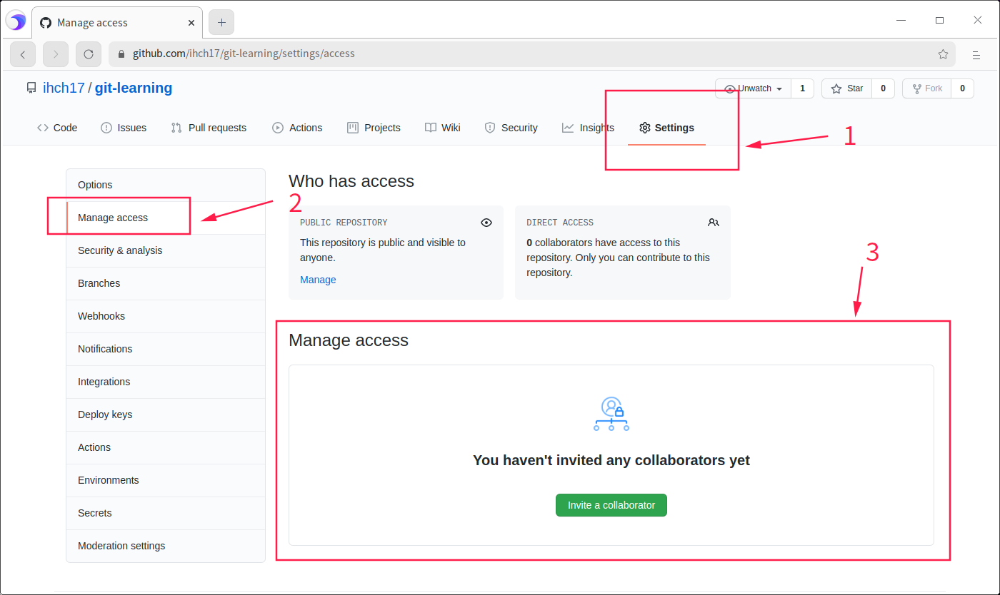
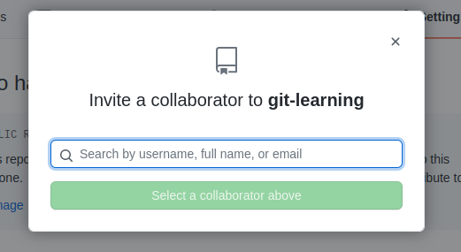
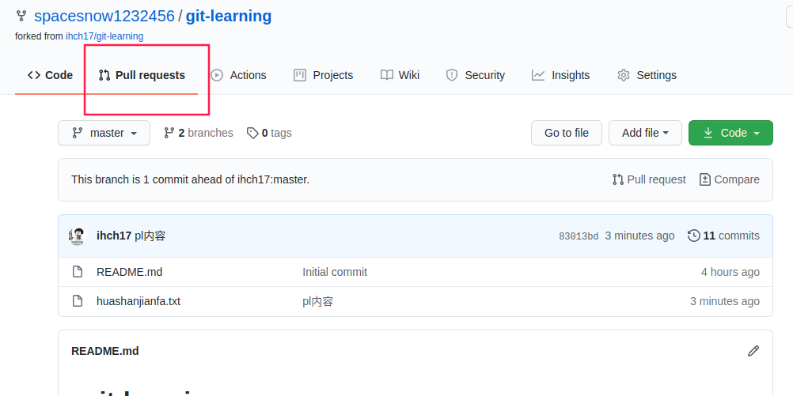
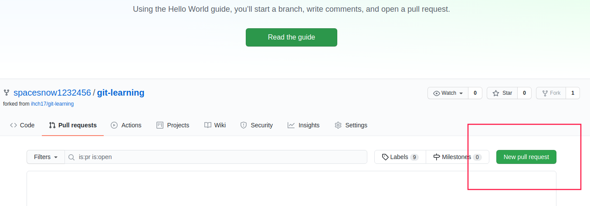
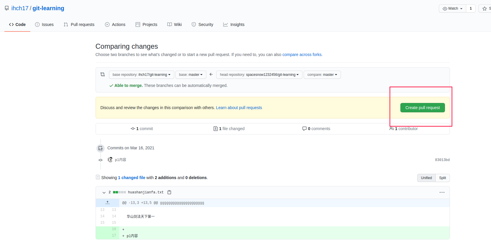
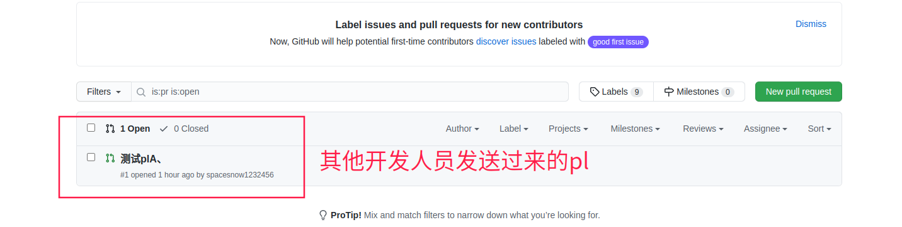
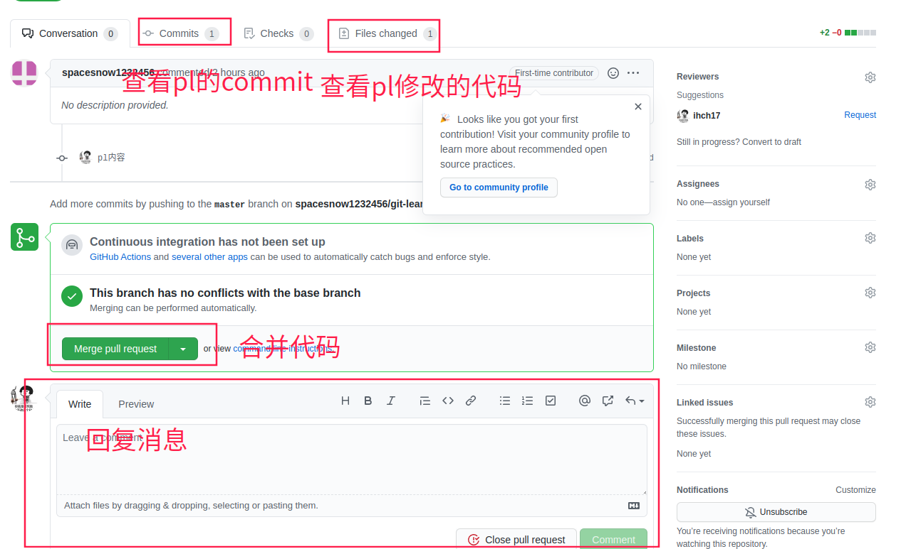
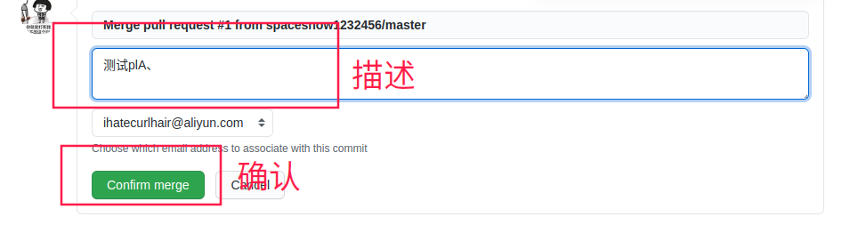

[toc]

# 设置SSH登陆

1. [生成公私钥](https://docs.github.com/en/github/authenticating-to-github/generating-a-new-ssh-key-and-adding-it-to-the-ssh-agent)
2. [绑定github帐号](https://docs.github.com/en/github/authenticating-to-github/adding-a-new-ssh-key-to-your-github-account)

# Github使用

## 本地项目推送到Github

1. 在Github新建项目

2. 本地添加github地址

   ```bash
   git remote add origin git@github.com:xxxxxx.git	# origin为git地址别名，后面为git远程仓库地址
   git remote -v # 查看所有remote
   ```

3. 推送

   ```bash
   git push origin master	# 将master分支推送到别名为origin的远程地址上
   git push origin --all	# 推送所有分支
   ```

   **注意**：有时候我们新建github远端项目时，勾选了新建readme文件，导致origin/master分支与本地master分支为无关联（非fast-forward）分支

   ```bash
    ! [rejected]        master -> master (fetch first)
   error: 推送一些引用到 'git@github.com:ihch17/git-learning.git' 失败
   提示：更新被拒绝，因为远程仓库包含您本地尚不存在的提交。这通常是因为另外                                                                                                                       
   提示：一个仓库已向该引用进行了推送。再次推送前，您可能需要先整合远程变更
   提示：（如 'git pull ...'）。
   提示：详见 'git push --help' 中的 'Note about fast-forwards' 小节。
   ```

   这时我们要先允许无关联分支进行merge，再push

   ```bash
   git merge --allow-unrelated-histories origin/master
   ```

## clone项目

将远程库clone到本地

```bash
git clone xxxxxxxx.git
```

clone操作有三个效果：

1. 将远程库下载到本地
2. 创建origin远程地址别名
3. 初始化本地库

## 拉取+合并

> pull = fetch + merge
>
> 在拉取合并内容较多的时候，建议使用fetch+merge，方便对内容进行核对

### fetch

> 将远程库内容下载到本地，但不会修改工作区文件

```bash
git fetch origin master	# 将别名为origin的master分支下载下来，但是并不和本地合并
git checkout origin/master	# 切换到下载下来的分支
```

### merge

```bash
git merge origin/master	# 将远程的origin/master合并到本地的master
```

### pull

```bash
git pull origin master # 拉取别名为origin下的master分支到本地，并进行合并
```


## 邀请其他成员

> 其他成员在clone项目之后，并不能直接进行提交。需要被项目发起人邀请后，才能进行开发提交





## 冲突解决

> 在团队合作中，不同开发者针对同一个文件进行修改，就会发生冲突。
>
> 第一个提交的开发者不会遇到问题，后续开发者提交，都会报错，需要先对该文件进行修改。

1. 先拉取代码

   ```bash
   git pull origin master
   ```

2. 拉取代码后，此时的分支进入MERGING状态（master/MERGING）

3. 进行代码修改再从新进行提交

   **注意**：commit的时候，git commit命令后面不能加文件名称：git commit -m'xxx' ~~xxxx.txt~~

## 跨团队协作

1. 将别人项目fork到自己的github空间

   

2. fork后，就可以针对自己github上的远程仓库进行正常的clone、push等操作

3. 在自己的github上进行修改完成并push成功后，进行pull request操作

   1. ​	
   2. 
   3. 
   4. pl成功

4. 这时，项目owner将要对次pl进行整合

   1. 收到pl后，在pull requests中会有数字显示

      

   2. 

   3. 

   4. 代码确认没有问题，点击合并代码。完成一次pl

      
