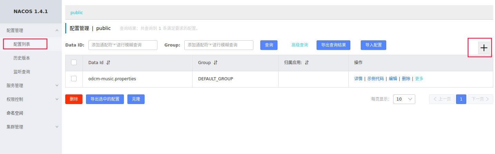
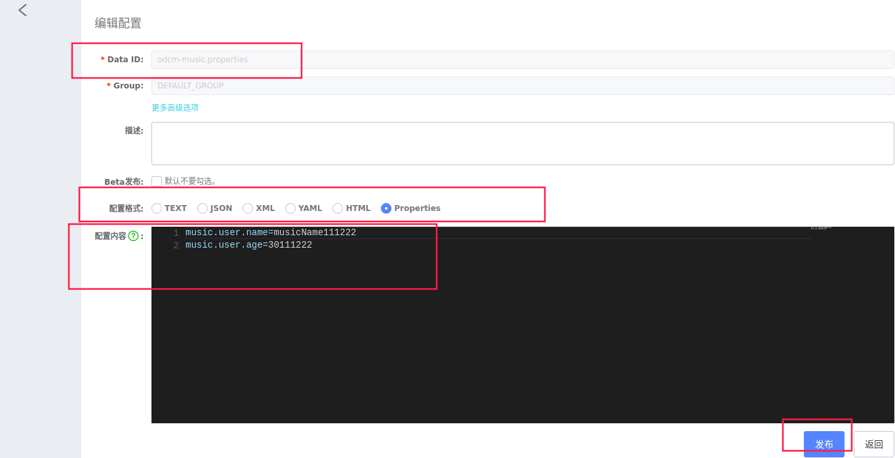

[toc]

# 概述

此项目为自己胡乱写的练习项目，没有任何实际意义

[项目地址](https://github.com/ihch17/old-drivers-cloud-music)

# Nacos服务注册中心

## 启动nacos

- 控制台登录地址：localhost:8848/nacos
- 默认账户名密码：nacos/nacos

## 代码整合

1. 导入nacos包

   ```xml
   <!--使用nacos作为服务注册中心-->
   <dependency>
       <groupId>com.alibaba.cloud</groupId>
       <artifactId>spring-cloud-starter-alibaba-nacos-discovery</artifactId>
   </dependency>
   ```

2. 配置文件中配置服务名称和使用nacos作为配置中心

   ```yaml
   # 服务名称
   application:
    name: odcm-user
   
   cloud:
   # 使用nacos作为注册中心
    nacos:
     discovery:
      server-addr: 127.0.0.1:8848
   ```

3. 启动类上加上nacos注解

   ```java
   @EnableDiscoveryClient
   ```


# OpenFeign远程调用

`注：实例中，Music服务远程调用User服务`

1. 导入openFeign

   ```xml
   <dependency>
   	<groupId>org.springframework.cloud</groupId>
   	<artifactId>spring-cloud-starter-openfeign</artifactId>
   </dependency>
   ```

2. music服务中，编写一个接口，告知springcloud需要调用的远程服务。**目标方法中的pojo，最好抽取到公共包下，方便其他服务引用。**

   ```java
   @Component 				// 注入spring容器
   @FeignClient("odcm-user")	// 告知springcloud需要调用的远程服务的名称：nacos中注册的服务名
   public interface FeignUserInterface {
   	// 目标服务的请求路径接口
       @GetMapping("/users")
       public List<User> getALlUsers();
   }
   ```

3. 在启动类中启动feign，并注明远程服务接口的所在路径

   ```java
   @EnableFeignClients(basePackages = "priv.ihch17.odcmmusic.feign")
   ```

# Nacos配置中心

1. 引入Nacos config包

   ```xml
   <!--使用nacos作为配置中心-->
   <dependency>
       <groupId>com.alibaba.cloud</groupId>
       <artifactId>spring-cloud-alibaba-nacos-config</artifactId>
   </dependency>
   ```

2. 项目中创建bootstrap.yml配置文件，**该配置文件优先于spplication.yml进行加载**。

   ```yaml
   spring:
     # 服务名称
     application:
       name: odcm-music
     cloud:
       nacos:
         # nacos作为服务注册发现中心
      discovery:
           server-addr: 127.0.0.1:8848
         # nacos作为配置中心
         config:
           server-addr: 127.0.0.1:8848
   ```
   
3. 在nacos控制界面中进行以下操作

   1. 
   2. 
   3. DataId默认规则为spring.application.name，后缀为文件类型，此处为odc-music.properties

4. 在controller中加入以下内容，用以接收配置信息。

   ```java
   @Value("${music.user.name}")
   private String musicUserName;
   
   @Value("${music.user.age}")
   private int musicUserAge;
   ```

5. 动态刷新，需要在@controller同级添加

   ```java
   @RestController
   @RefreshScope
   
   ```
```
   

## 细节

1. 配置集目录

   命名空间

   ​	|

   ​	 ----group

   ​				|

   ​				 ----Data ID

2. 最佳实现：bootstrap.yml配置中只留下服务名称和配置中心相关配置，其余均可放入配置中心中

   ```yaml
   spring:
     # 服务名称
     application:
       name: odcm-music
     cloud:
       nacos
         # nacos作为配置中心
         config:
           # 服务器地址+端口
           server-addr: 127.0.0.1:8848
           # 命名空间
           namespace: 18455215-3367-4576-82d1-e36b2cc7fced
           # 分组
           group: dev
   
           # 加载指定配置文件
           #ext-config:
           #  - data-id: mybatis.yaml
           #    grop: dev
           #    refresh: true
```

3. 加载多个配置集：ext-config是一个list，里面可放入一个配置的集合

# Gateway网关

## 关键概念

1. Routes：路由
2. Ptedicates：断言
3. Filter：过滤器

## 代码

1. 开启服务注册与发现

2. 配置配置中心

3. 由于gateway网关无需链接数据库，所以`排除数据源依赖`

   ```java
   @SpringBootApplication(exclude = DataSourceAutoConfiguration.class)
   ```

4. 